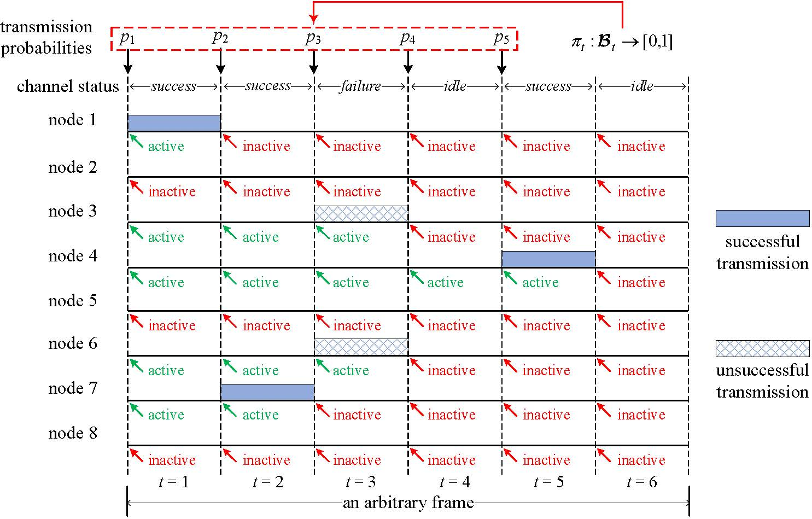

# Dynamic Optimization of Random Access in Deadline-Constrained Broadcasting

<div align="center">
<p>

</p>
</div>


## Introduction

This paper considers dynamic optimization of random access in deadline-constrained broadcasting with frame-synchronized traffic. Under the non-retransmission setting, we define a dynamic control scheme that allows each active node to determine the transmission probability based on the local knowledge of current delivery urgency and contention intensity (i.e., the number of active nodes). For an idealized environment where the contention intensity is completely known, we develop a Markov Decision Process (MDP) framework, by which an optimal scheme for maximizing the timely delivery ratio (TDR) can be explicitly obtained. For a realistic environment where the contention intensity is incompletely known, we develop a Partially Observable MDP (POMDP) framework, by which an optimal scheme can only in theory be found. To overcome the infeasibility in obtaining an optimal or near-optimal scheme from the POMDP framework, we investigate the behaviors of the optimal scheme for extreme cases in the MDP framework, and leverage intuition gained from these behaviors together with an approximation on the contention intensity knowledge to propose a heuristic scheme for the realistic environment with TDR close to the maximum TDR in the idealized environment. We further generalize the heuristic scheme to support retransmissions. Numerical results are provided to validate our study.


## How to Reproduce Our Experiments

You can reproduce our experiments using **MATLAB R2021a** on your local machine.

- First, create a folder called `PomdpBroadcast` on your local machine, i.e., `./PomdpBroadcast`.

- Second, make sure the structure of the folder is the same as in the **Folder Structure** section.
  - `git clone` our repo to your local machine and then move the code to the folder.
    ```
    git clone https://github.com/aygong/PomdpBroadcast.git
    ```

- Last, run the provided scripts `main_without_retran.m` or `main_with_retran.m` with `Run`.


## Folder Structure

```
./PomdpBroadcast
├── README.md
|
├── function_computing.m       # Compute the MDP and POMDP functions
|
├── main_without_retran.m      # Compare without retransmissions
├── idea_opt_ana.m             # Analyze the optimal scheme (idealized)
├── idea_opt_sim.m             # Simulate the optimal scheme (idealized)
├── idea_myo_ana.m             # Analyze the myopic scheme (idealized)
├── idea_myo_sim.m             # Simulate the myopic scheme (idealized)
├── real_heu_sim.m             # Simulate the proposed heuristic scheme (realistic)
├── real_sta_ana.m             # Analyze the optimal static scheme (realistic)
├── real_sta_sim.m             # Simulate the optimal static scheme (realistic)
├── real_myo_sim.m             # Simulate the myopic scheme (realistic)
|
├── main_with_retran.m         # Compare with retransmissions
├── subframe_dividing.m        # Divide a frame into consecutive subframes
├── real_heuR_sim.m            # Simulate the proposed heuristic scheme (realistic)
└── real_staR_sim.m            # Simulate the optimal static scheme (realistic)
```


## Citation

```
@article{gong2021dynamic,
  title={Dynamic optimization of random access in deadline-constrained broadcasting},
  author={Gong, Aoyu and Zhang, Yijin and Deng, Lei and Liu, Fang and Li, Jun and Shu, Feng},
  journal={arXiv preprint arXiv:2108.03176},
  year={2021}
}
```
